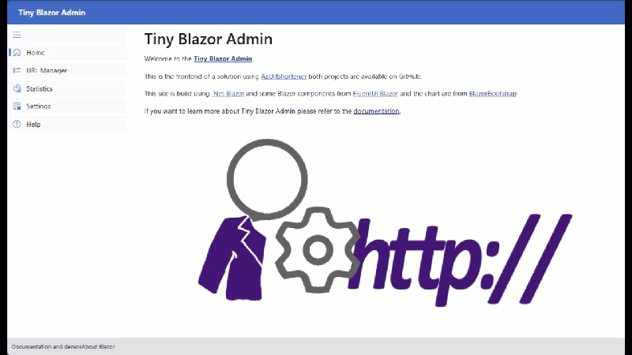

# Azure Url Shortener (AzUrlShortener)

    

<!-- ALL-CONTRIBUTORS-BADGE:START - Do not remove or modify this section -->

<!-- ALL-CONTRIBUTORS-BADGE:END -->

![UrlShortener][UrlShortener]

A simple and easy to use and to deploy budget-friendly Url Shortener for everyone. It runs in your Azure (Microsoft cloud) subscription.  

> If you don't own an Azure subscription already, you can create your **free** account today. It comes with 200$ credit, so you can experience almost everything without spending a dime. [Create your free Azure account today](https://azure.microsoft.com/free?WT.mc_id=dotnet-0000-frbouche)

Features:

- Redirect different destination base on schedules.
- Keep Statistics of your clicks.
- Budget-friendly and 100% open-source.
- Extensible for more enterprise-friendly configurations
- Simple step by step deployment. 
  

## How To Deploy

👉 **[Step by Step Deployment](doc/how-to-deploy.md)** 👈 documentation is available here.

If you want to **Update** or **Upgrade**, please refer to [the faq page](doc/faq.md). 

## How To Use It

Once deployed, use the admin webApp (aka TinyBlazorAdmin) to create new short URLs. 

### Alternative Admin Tool

By default, all the required resources are deployed into Azure. However you can decide to run the [API](src/Cloud5mins.ShortenerTools.Api/) locally, in a container or somewhere else. You can than use an API client like [Postman](https://www.postman.com/) or a plugin to VSCode like [REST Client](https://marketplace.visualstudio.com/items?itemName=humao.rest-client), to manage your URLs. We've included simple API calls via a postman collection and environment [here](./src/tools/).

You can also directly update the tables in storage using [Azure Storage Explorer](doc/how-to-use-azure-storage-explorer.md). 

---

## Videos

There is also a videos that explains a bit how things works and does a quick tour of the project.

| Cloud 5 Mins | Azure Friday |
| ---          | --- |
|  |   |

---

## What's Next?

We are always trying to make it better. See the [AzUrlShortener project](https://github.com/users/FBoucher/projects/6/views/4) page and [issues](https://github.com/microsoft/AzUrlShortener/issues) to see the current progress. 

You are invited to go into the [Discussion](https://github.com/microsoft/AzUrlShortener/discussions) tab to share your feedback, ask question, and suggest new feature! Or have look at our [faq](doc/faq.md) page for more information.

Current Backlog contains:
- More Statistics
- QR Code
- More tracking information (like Country)
- etc.

---

## Contributing

If you find a bug or would like to add a feature, check out those resources:

Check out our [Code of Conduct](CODE_OF_CONDUCT.md) and [Contributing](CONTRIBUTING.md) docs. This project follows the [all-contributors](https://github.com/all-contributors/all-contributors) specification.  Contributions of any kind welcome!

## Contributors ✨

Thanks goes to these wonderful people ([emoji key](https://allcontributors.org/docs/en/emoji-key)):

<!-- ALL-CONTRIBUTORS-LIST:START - Do not remove or modify this section -->
<!-- prettier-ignore-start -->
<!-- markdownlint-disable -->
<table>
  <tbody>
    <tr>
      <td align="center" valign="top" width="14.28%"><a href="https://github.com/surlydev"> <b>SurlyDev</b></a> <a href="#ideas-surlydev" title="Ideas, Planning, & Feedback">🤔</a></td>
      <td align="center" valign="top" width="14.28%"><a href="http://cloud5mins.com"> <b>Frank Boucher</b></a> <a href="https://github.com/microsoft/AzUrlShortener/commits?author=FBoucher" title="Code">💻</a> <a href="#video-FBoucher" title="Videos">📹</a> <a href="https://github.com/microsoft/AzUrlShortener/issues?q=author%3AFBoucher" title="Bug reports">🐛</a></td>
      <td align="center" valign="top" width="14.28%"><a href="https://github.com/AK0785"> <b>AKER</b></a> <a href="#ideas-AK0785" title="Ideas, Planning, & Feedback">🤔</a></td>
      <td align="center" valign="top" width="14.28%"><a href="http://baaijte.net"> <b>Vincent Baaij</b></a> <a href="https://github.com/microsoft/AzUrlShortener/commits?author=vnbaaij" title="Code">💻</a></td>
      <td align="center" valign="top" width="14.28%"><a href="https://github.com/kmm7"> <b>kmm7</b></a> <a href="https://github.com/microsoft/AzUrlShortener/commits?author=kmm7" title="Code">💻</a> <a href="#ideas-kmm7" title="Ideas, Planning, & Feedback">🤔</a></td>
      <td align="center" valign="top" width="14.28%"><a href="https://github.com/fs366e2spm"> <b>fs366e2spm</b></a> <a href="https://github.com/microsoft/AzUrlShortener/issues?q=author%3Afs366e2spm" title="Bug reports">🐛</a> <a href="#ideas-fs366e2spm" title="Ideas, Planning, & Feedback">🤔</a></td>
      <td align="center" valign="top" width="14.28%"><a href="https://github.com/Hedlund01"> <b>Hugo Hedlund</b></a> <a href="https://github.com/microsoft/AzUrlShortener/commits?author=Hedlund01" title="Code">💻</a></td>
    </tr>
    <tr>
      <td align="center" valign="top" width="14.28%"><a href="https://github.com/thefisk"> <b>Nathan Fisk</b></a> <a href="https://github.com/microsoft/AzUrlShortener/commits?author=thefisk" title="Documentation">📖</a></td>
      <td align="center" valign="top" width="14.28%"><a href="http://www.lexplore.com"> <b>Erik Alsmyr</b></a> <a href="https://github.com/microsoft/AzUrlShortener/issues?q=author%3Aalsmyr" title="Bug reports">🐛</a> <a href="https://github.com/microsoft/AzUrlShortener/commits?author=alsmyr" title="Documentation">📖</a></td>
      <td align="center" valign="top" width="14.28%"><a href="https://jawn.net"> <b>Bernard Vander Beken</b></a> <a href="https://github.com/microsoft/AzUrlShortener/commits?author=jawn" title="Documentation">📖</a></td>
      <td align="center" valign="top" width="14.28%"><a href="https://github.com/IronManion"> <b>IronManion</b></a> <a href="https://github.com/microsoft/AzUrlShortener/commits?author=IronManion" title="Documentation">📖</a></td>
      <td align="center" valign="top" width="14.28%"><a href="http://www.jasonhand.com"> <b>Jason Hand</b></a> <a href="https://github.com/microsoft/AzUrlShortener/commits?author=jasonhand" title="Documentation">📖</a> <a href="#infra-jasonhand" title="Infrastructure (Hosting, Build-Tools, etc)">🚇</a></td>
      <td align="center" valign="top" width="14.28%"><a href="https://Microsoft.com"> <b>Scott Cate</b></a> <a href="https://github.com/microsoft/AzUrlShortener/commits?author=scottcate" title="Code">💻</a></td>
      <td align="center" valign="top" width="14.28%"><a href="https://github.com/arglgruml"> <b>arglgruml</b></a> <a href="https://github.com/microsoft/AzUrlShortener/issues?q=author%3Aarglgruml" title="Bug reports">🐛</a></td>
    </tr>
    <tr>
      <td align="center" valign="top" width="14.28%"><a href="https://github.com/DavidTCarpenters"> <b>DavidTCarpenters</b></a> <a href="https://github.com/microsoft/AzUrlShortener/commits?author=DavidTCarpenters" title="Code">💻</a></td>
      <td align="center" valign="top" width="14.28%"><a href="https://github.com/solvaholic"> <b>Roger D. Winans</b></a> <a href="https://github.com/microsoft/AzUrlShortener/commits?author=solvaholic" title="Documentation">📖</a></td>
      <td align="center" valign="top" width="14.28%"><a href="https://github.com/fatpacket"> <b>fatpacket</b></a> <a href="https://github.com/microsoft/AzUrlShortener/commits?author=fatpacket" title="Documentation">📖</a></td>
      <td align="center" valign="top" width="14.28%"><a href="https://github.com/ch-rob"> <b>Chad Voelker</b></a> <a href="https://github.com/microsoft/AzUrlShortener/commits?author=ch-rob" title="Code">💻</a> <a href="https://github.com/microsoft/AzUrlShortener/commits?author=ch-rob" title="Documentation">📖</a></td>
      <td align="center" valign="top" width="14.28%"><a href="https://github.com/davidmginn"> <b>David Ginn</b></a> <a href="https://github.com/microsoft/AzUrlShortener/commits?author=davidmginn" title="Code">💻</a></td>
      <td align="center" valign="top" width="14.28%"><a href="http://www.c-sharpcorner.com/members/catcher-wong"> <b>Catcher Wong</b></a> <a href="https://github.com/microsoft/AzUrlShortener/commits?author=catcherwong" title="Code">💻</a></td>
      <td align="center" valign="top" width="14.28%"><a href="https://github.com/stulzq"> <b>Zhiqiang Li</b></a> <a href="https://github.com/microsoft/AzUrlShortener/commits?author=stulzq" title="Code">💻</a></td>
    </tr>
    <tr>
      <td align="center" valign="top" width="14.28%"><a href="https://github.com/ddematheu2"> <b>ddematheu2</b></a> <a href="https://github.com/microsoft/AzUrlShortener/issues?q=author%3Addematheu2" title="Bug reports">🐛</a> <a href="https://github.com/microsoft/AzUrlShortener/commits?author=ddematheu2" title="Code">💻</a></td>
      <td align="center" valign="top" width="14.28%"><a href="https://davidop.code.blog/"> <b>David Oliva Paredes</b></a> <a href="https://github.com/microsoft/AzUrlShortener/commits?author=davidop" title="Code">💻</a></td>
    </tr>
  </tbody>
</table>

<!-- markdownlint-restore -->
<!-- prettier-ignore-end -->

<!-- ALL-CONTRIBUTORS-LIST:END -->

This project follows the [all-contributors](https://github.com/all-contributors/all-contributors) specification. Contributions of any kind welcome!

> This project was inspired by a project created by [Jeremy Likness](https://github.com/JeremyLikness) that you can find here [jlik.me](https://github.com/JeremyLikness/jlik.me).

[UrlShortener]: images/UrlShortener_600.png
