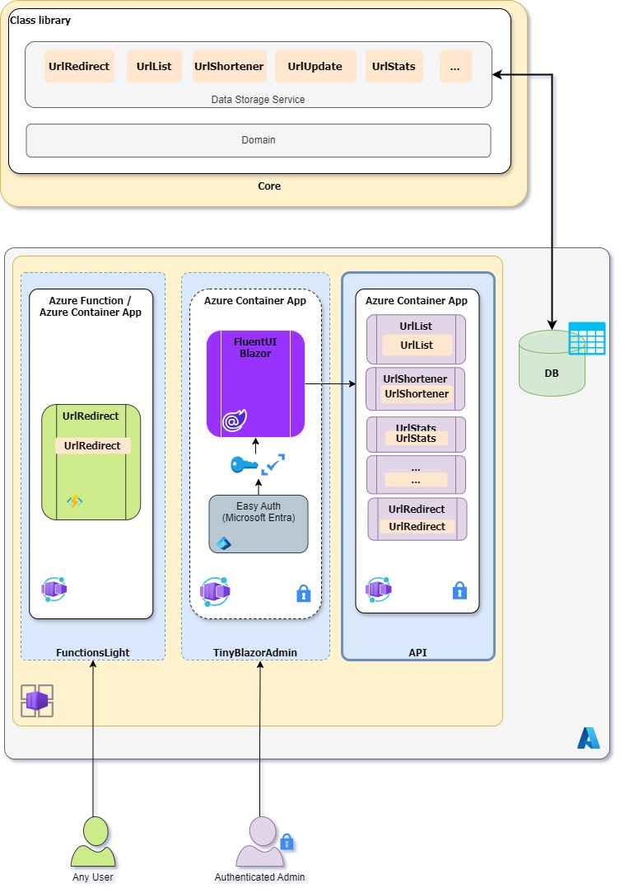

How It Works
============

The backend is using Azure Functions and Azure Table Storable this page will explains how they work together in this tool.

## Azure Functions

Azure Functions were the perfect match for this project because when you use a dynamic plan you are charged only when the function is running. In our case, it's only a few seconds at the time. To know more read [Azure Function Pricing](https://azure.microsoft.com/en-us/pricing/details/functions/)

### Function: UrlRedirect

This function returns a HTTP Redirect to the URL. You can call it directly doing an HTTP request of type POST or GET passing the vanity at the end of the URL. The Azure Function Proxy will call Function passing the parameter.

For example, if the domain is *c5m.ca* and the vanity is "project", the request `c5m.ca/2w` will call "UrlRedirect/{shortUrl}" where `shortUrl` is equal to "project". end the result will be a redirect to the long URL save in the storage.

Every time the Azure Function is called it will increment the click count and save the timestamp when this call appends.

## Azure Table Storage

The [Azure table storage](https://docs.microsoft.com/en-us/azure/storage/tables/) are the data store in this project. They are a very convenient service to keep structured NoSQL data in the cloud. They are also typically lower in cost than traditional SQL for similar volumes of data.

You can explore the Azure Table storage from Azure portal or using the [Azure Storage Explorer](https://docs.microsoft.com/en-us/azure/vs-azure-tools-storage-manage-with-storage-explorer?tabs=windows#overview) it's a nice free tool that is available on all platforms (MacOS, Linux, Windows).

There are two tables that will be automatically created at the first call.

### Table: ClickStats

The ClickStats table get a new entry at every call of the Azure Function **UrlRedirect** with the Datetime value.

### Table: UrlDetails

The UrlDetails table has the information about all the URLs created. The Vanity, URL, and number of clicks.

## Security Considerations

Review [Security Considerations](./security-considerations.md) and choose and implement an appropriate authorization approach.