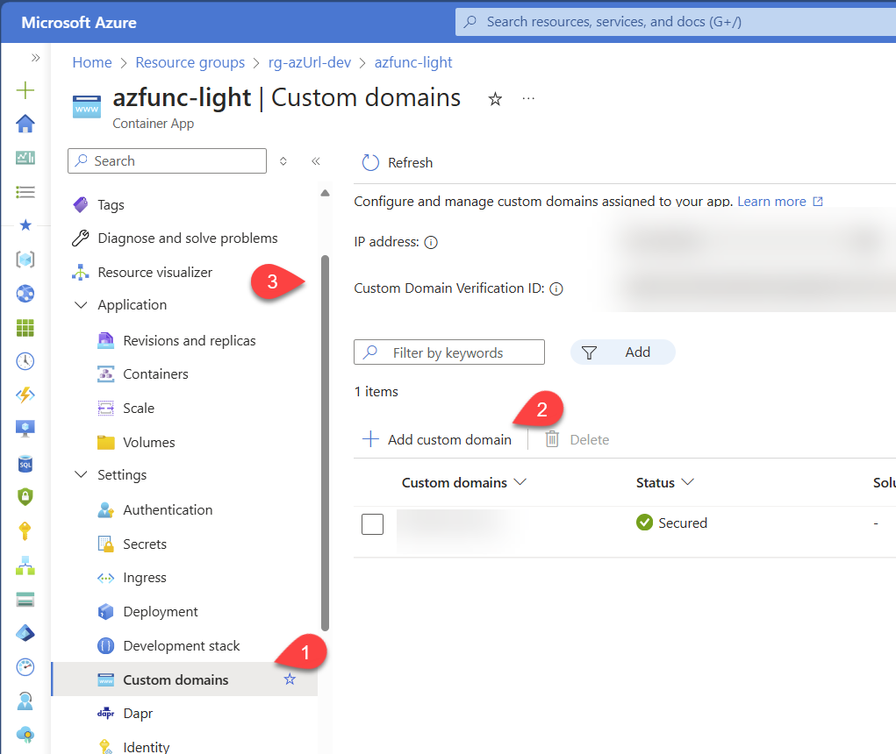

# How to Add a Custom Domain

From the Azure Portal, Open the Azure COntainer Apps named `azfunc-light`. This is the one doing the redirect, this is where you want yout custom domain to be used.

From the left menu, select **Custom domains** and click on **Add custom domain**.

Follow the instructions to add your custom domain. Note that it may takes a few minutes for the domain to all be setup. Once it is, you should see the domain listed in the custom domains list withthe green check mark.

## Add a custom domain to the admin website

To make it easier to find the TinyBlazorAdmin website, you can also add a custom domain to it. From your Domain provider (GoDaddy, NameCheap, etc.), you can set a forwarding subdomain to the admin website. For example, if you want to use `admin.yourdomain.com`, you can set a forwarding rule to the URL of the admin website (e.g., `https://admin-azfunc-light.azurecontainerapps.io`). This way, you can access the TinyBlazorAdmin website using your custom domain.

