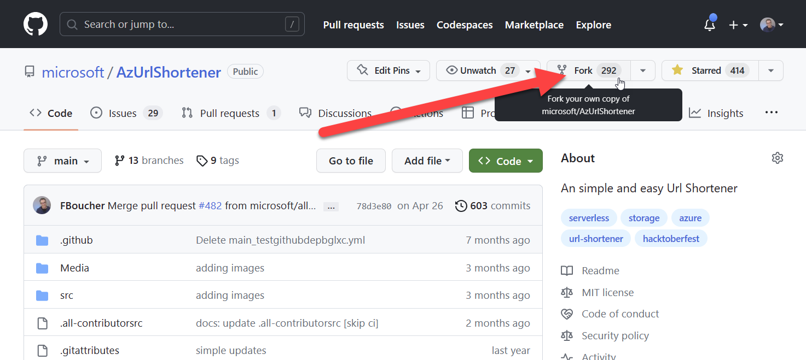
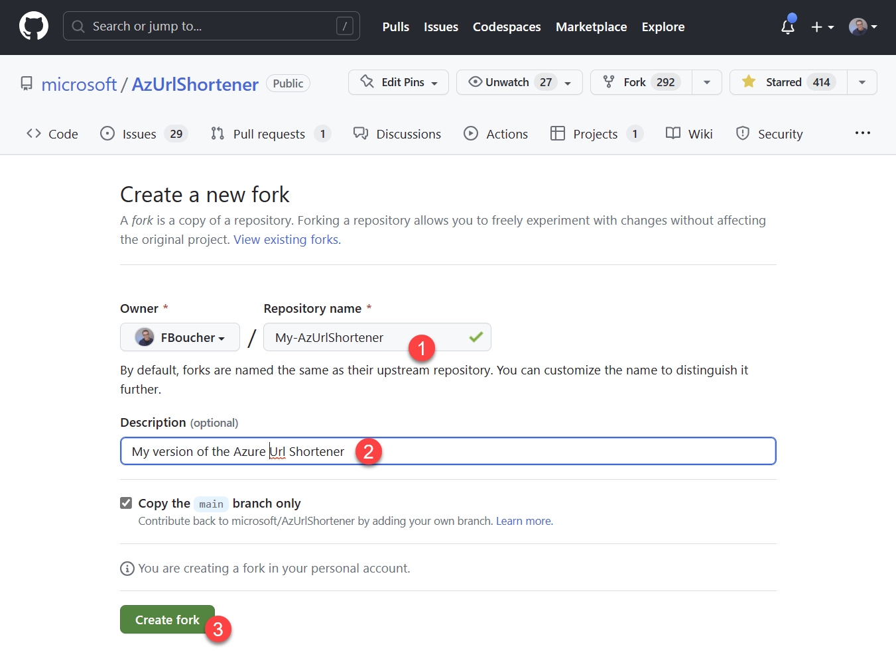
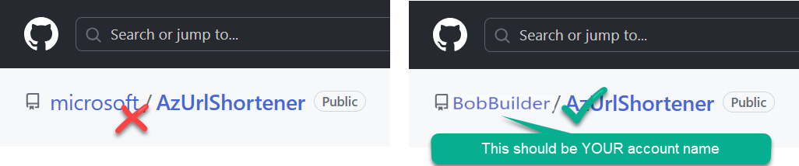
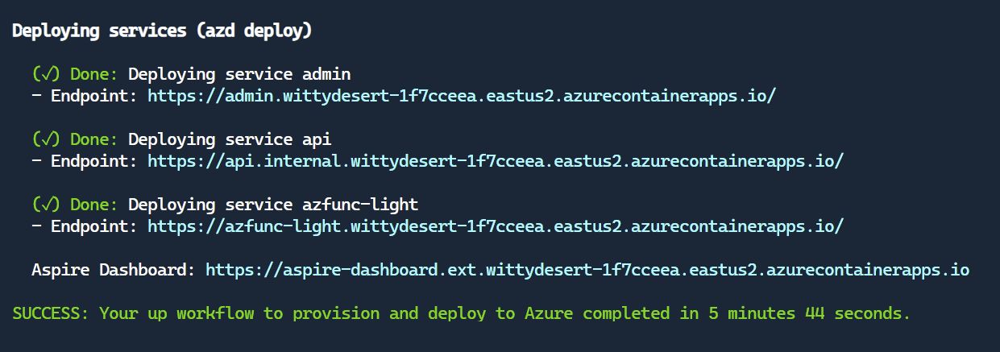
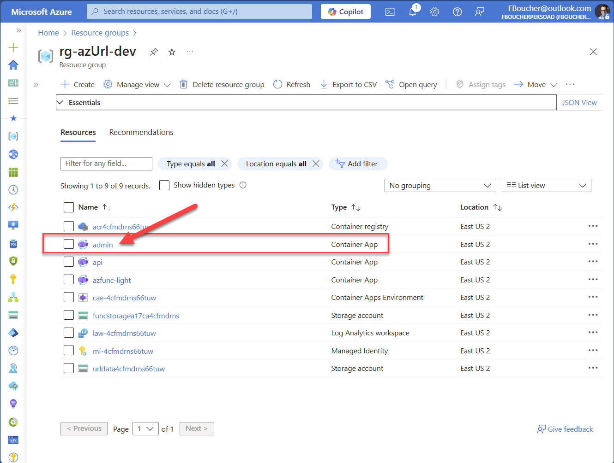
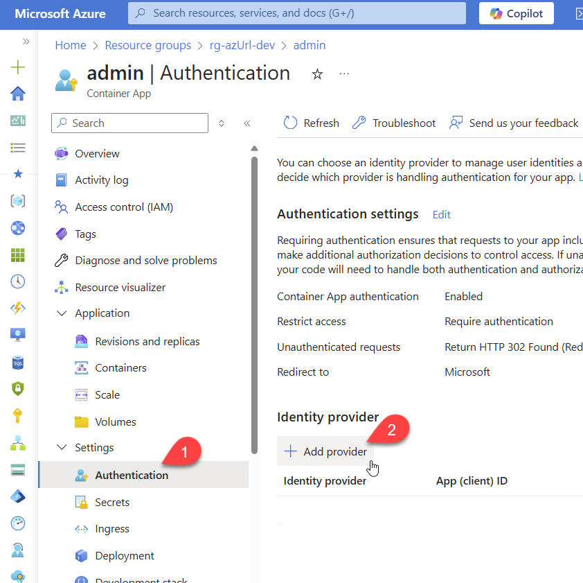

# How to deploy your AzUrlShortener

## First thing first

### 👉 **Fork this repository** into your own account

> To Fork GitHub repository click on the Fork button on the top right of the screen.



Provide a name. It can be anything, it just needs to be unique in your account (you can keep AzUrlShortener if you want). Add a description it you want and click the button **Create repository from template**. 



After a few seconds, you should now be in your version of the AzUrlShortener project. If you need more detail have a look to this GitHub doc: [Fork a repo](https://docs.github.com/en/free-pro-team@latest/github/getting-started-with-github/fork-a-repo).

> Make sure you are currently in YOUR GitHub repository.
>
>


## Prerequisites

- [Docker Desktop](https://www.docker.com/products/docker-desktop/) or [Podman](https://podman.io/getting-started/installation)
- [Azure Developer CLI](https://learn.microsoft.com/en-us/azure/developer/azure-developer-cli/install-azd)


## Deploying to Azure

1. In a terminal, navigate to the `src` directory of your project.

	```bash
	cd src
	```
1. If you haven't already, log in to your Azure account with `azd auth login`.
1. To avoid affecting custom domains when deploying Azure Container Apps use the following command. This mostly useful if you are re-deploying, or updating an existing application. If you don't have any custom domain assign to the Azure Container Apps, you can still execute the command, but it's optional.
   
	```bash
	azd config set alpha.aca.persistDomains on
	```

1. Provision all required Azure resources and deploy the application with the following command:

	```bash
	azd up
	```

1. Get the application URL

After the deployment is complete, you will see the URLs of your applications in the terminal; the one starting by `https://admin` is the admin tools (aka TinyBlazorAdmin), and the one starting with `https://azfunc-light` is the redicrect service. There is also many details about the resources created in Azure, and a link to the .NET Aspire dashboard.



## Add authentication to the admin website

The app is now deployed, but it does not have authentication enabled. Navigate to the [Azure Portal](https://portal.azure.com/), and find the Resource Group you just deployed (e.g., rg-azUrl-dev). From there, select the Container App named **admin**.



From the left menu, select **Authentication** and click **Add identity provider**.



You can choose between multiple providers, but let's use Microsoft since it's deployed in Azure and you are already logged in. Once Microsoft is chosen, you will see many configuration options. Select the recommended client secret expiration (e.g., 180 days).

You can keep all the other default settings. Click **Add**. After a few seconds, you should see a notification in the top right corner that the identity provider was added successfully.

Voila! Your app now has authentication.

Next time you navigate to the app, you will be prompted to log in with your Microsoft account. Notice that your entire app is protected. No page is accessible without authentication.

The first time you log in, you will see a Permissions requested screen. Check the **Consent** checkbox, and click **Accept(()).