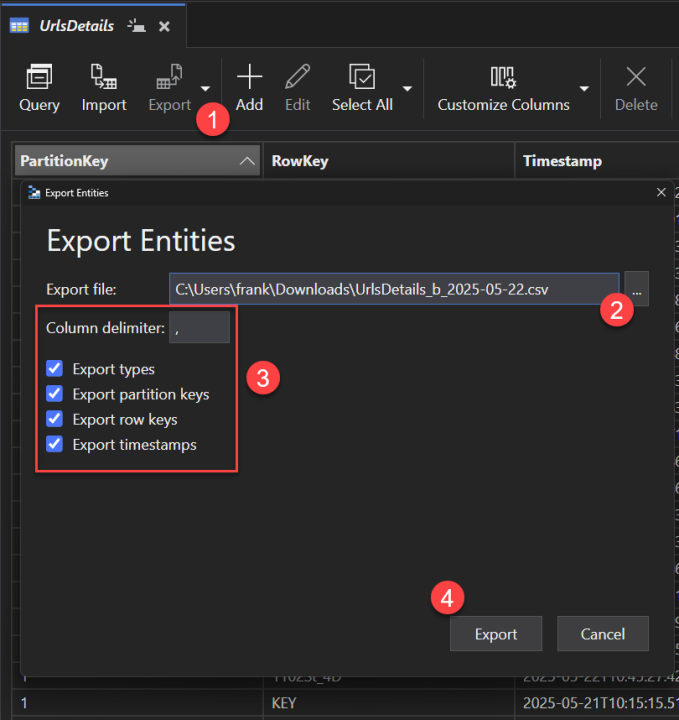
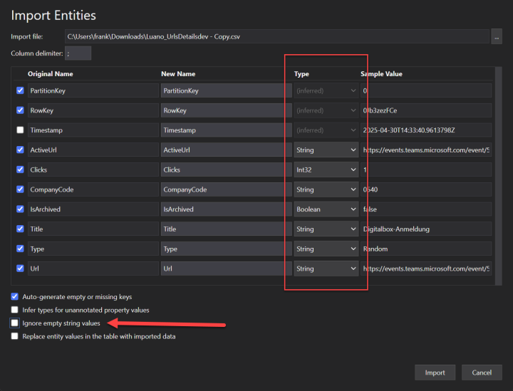

# HowAzure Storage Explorer is a free tool to manage your Azure cloud storage resources (aka your short URLs) from your desktop. It's cross-platform and can be downloaded [here](https://azure.microsoft.com/en-us/products/storage/storage-explorer/).

In the resources deployed to Azure, there will be 2 storage accounts. One for the redirect service (azfunc-light) and one acting as the data store. That last one is the one you want to use for the data migration. The name of that storage account should start with `urldata`. migrate your data

The easiest way to migrate your data between accounts or from an earlier version of AzUrlShortener is to use the **Azure Storage Explorer** to export the data as CSV files and use the TinyBlazorAdmin to import the files.

Azure Storage Explorer is a free tool to manage your Azure cloud storage resources (aka your short URLs) from your desktop. It’s a cross-platform and can be downloaded [here](https://azure.microsoft.com/en-us/products/storage/storage-explorer/). 

In the resources deployed to Azure there will be 2 storage accounts. One for the redirect service (azfunc-light) and one acting as the data store. That last one is the one you want to use for the data migration. The name of that storage account should start wirh `urldata`. 

You need to export to CSV the following tables:
- UrlsDetails: This table contains the details of the short URLs, including the original URL, the short URL, schedules, etc.
- ClickStats: This table contains the click information.

The best settings to export when planning to import using the TinyBlazorAdmin are:

To import the data use the Import button in the Settings page.

If you have customized the structure of the tables by adding custom columns, you will need to import the data using Azure Storage Explorer instead to keep those columns.

Here are the settings to use when importing using Azure Storage Explorer:
- Make sure you use the same column delimiters as used in the export.
- You need to select the data type for each column.
- Uncheck the checkbox *Ignore empty string values*.

