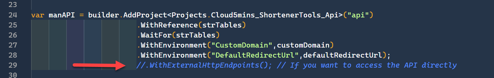
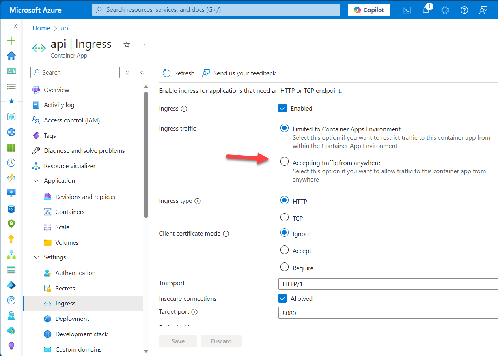

# How to make the api public

When the solution is running locally the API is accessible so you can call it from different tools, but once deploy in Azure the API doesn't have public endpoints. This was done for security purposes, where only the other resources from the same Container Apps Environment have access. If you would like to change this it's possible to do it pre or post deployment.

> **Note:** The API is not password protected, so anyone with the URL can use it.

## Before deployment
In the `src\AppHost` project open the `program.cs` file and uncomment the line 

Deploy, or re-deploy with `az up`.

## After deployment
If you would like to make the endpoints public this can be done via the Azure Portal. From the Azure Container App `api`, click on `Ingress` in the Settings section on the left panel. Then change the `Ingress traffic` to **Accepting traffic from anywhere**

