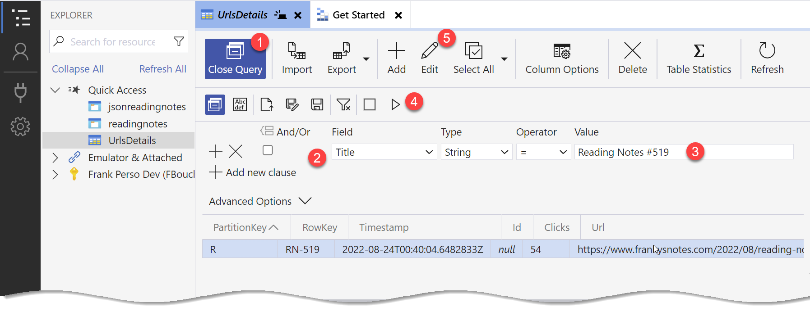

Azure Storage Explorer is a free tool to manage your Azure cloud storage resources (aka your short URLs) from your desktop. It’s a cross-platform and can be downloaded [here](https://azure.microsoft.com/en-us/products/storage/storage-explorer/). 

Once installed, you need to configure it to access your Azure account. You can do this by clicking on the Open connection dialog the **DC plug** icon in the top left corner, then select the Azure Subscription option.

And follow the steps to login to your Azure account.

## Find the URLs Storage table

To find the table where the URLs data is saved, expend your subscription (with the key icon) in the tree view. Expand the Storage accounts, your account (probably starting by 'shortenertool' and ending with 'sa'), tables, and finally look for. `UrlsDetails`

Pro tip: You can right-click on the table and select `Pin to Quick Access` to create a shortcut to it.

## Create a new Short URL

To create a new URL, make sure the `UrlsDetails` table is selected (directly or using the quick access), then click on the **+ Add** button in the top menu.

The *Add Entity* dialog window will open, You will need to fill it in order to create the URL.

- **Partition key:** (Required) This MUST be the first character of your short URL (aka RowKey).
- **RowKey:** (Required) The short URL.
- **Id:** Never set any value in this field, this is used by the system and URLs don’t need then.
- **Clicks:** Don’t set any value in this field, it will be incremented automatically when your short URL is used.
- **Url:** (Required) The original (aka long) URL.
- **Title:** (Optional) This is for your convenience. Write something that helps you understand what the URL is from.
- **Is Archived:** Since we create a new URL leaves that field empty.

> Alternatively, you could only add the properties: Partition key, RowKey, and the Url redirect will still work.

Once you are done, click on the **Insert** button. Congratulations, you have created a new URL, you can test it to be sure.

## Update an existing Short URL

First, we need to search for the URL that we want to edit, and we do this by executing a query. 

Click on the `Query` button in the top menu. Now depending on the information, you have changed the search parameters. 

Use the RowKey if you have the `vanity` (the end of the short URL), and set the PartitionKey equal to the first character of that vanity.

If you want to search with by Title, like in the screenshot, change one of the fields by `Title` and remove the other by clicking on the “X” button on the left of the row.

> Note: There is no wildcard search in Azure Storage Explorer, so you need to use the exact value.

Once you are ready, click on the triangle (play) button, to execute your query. If you did it correctly, you will see the URL you are looking for. You can click the **Edit** button, or double-click the result row to edit it.

You are invited to go into the [Discussion](https://github.com/microsoft/AzUrlShortener/discussions) tab to share your feedback, ask questions, and suggest new features!

