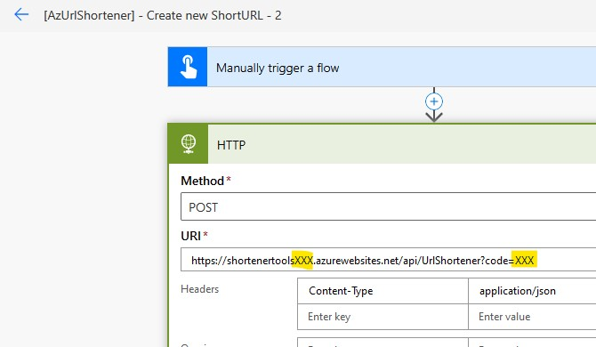
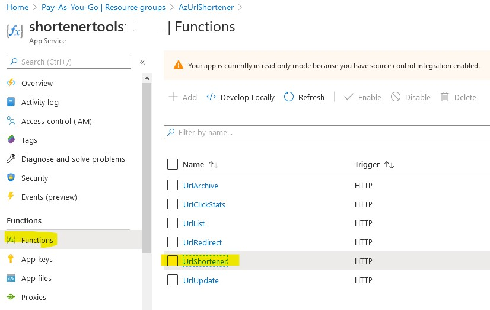
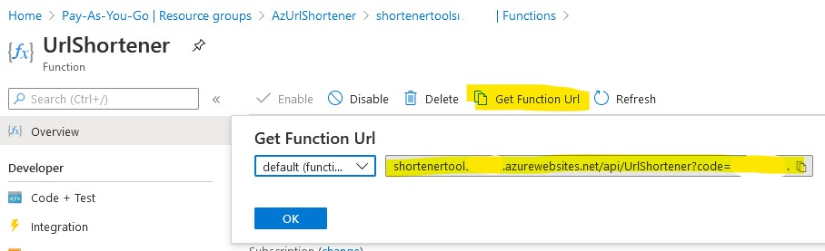
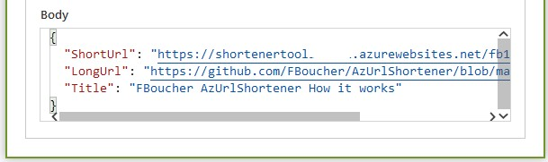

# PowerAutomate Flow
Like in postman you can also just use PowerAutomate Flows to create, update or archive or get all configured Urls.

The flows call the Azure Functions.

> The PowerAutomate Flows require a premium license (e.g. a per user license) to use the premium connectors.

## Deployment
You should have already deployed your version of the **Azure Url Shortener**

### Flow 1 - Create new ShortURL
[AzUrlShortener] - Create new ShortURL: [Download and import Flow](deployment/[AzUrlShortener]-CreatenewShortURL_20200621211731.zip)

When you open the new imported Flow you need to set the correct HTTP Url to the Azure Function.

For that goto your Azure Function App Service and copy the Url for the **UrlShortener** Azure Function.

When you run the Flow and you have set the correct URL to the Azure Function your new ShortUrl is created and returned in the HTTP call:

### Flow 2 - Get all URLs
[AzUrlShortener] - Get all Urls: [Download and import Flow](deployment/[AzUrlShortener]-GetallURLs_20200621214422.zip)

### Flow 3/4 - Update/Archive Url
Manual update or archive is not implemented as it requires to pass a few parameter which not be known (The update Flow can be done of course, it's implemented in the SharePoint list)
Parameters to pass (e.g. to change the long Url):
- new Url
- RowKey
- PartitionKey
- Vanity

Parameters to pass to archive a Url
- RowKey
- PartitionKey
- Vanity

---

## How to use it
Import the Flows and run them

---

## Question, problem?

If you have question or encounter any problem using this admin Frontend with AzShortenerUrl please feel free to ask help in the [issues section](https://github.com/FBoucher/AzUrlShortener/issues).

[adminBlazorWebsite_Url_list]: medias/adminBlazorWebsite_Url_list.png
[adminBlazorWebsite_Add_Url]: medias/adminBlazorWebsite_Add_Url.png
[portalConfig]: medias/portalConfig.png
