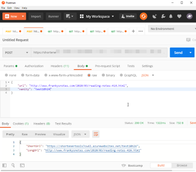

# Admin frontend for Azure Shortener Urls

You just deployed the AzShortenerUrl backend (the Azure Functions), and now you would like to be able to create Urls! There is many different ways to calls those Azure Functions from a direct HTTP call to a fancy website. 

Here, you will find the list of all available frontend with the instructions to deploy and use them.

---

## List of available Admin frontends


### 1- [Postman](postman/README.md)

Simple use of the API testing tool Postman to call the Azure Functions.



More details [here](postman/README.md).


### 2- [Admin Blazor Website](adminBlazorWebsite/README.md)

A simple website that implement the basic functionalities. You can list all URLs and create new ones. The website is done using Asp .Net Core Blazor with a server side. It can be deploy in Azure with one-click deployment.  


More details [here](adminBlazorWebsite/README.md).


### 3- [TinyBlazorAdmin Website](https://github.com/FBoucher/TinyBlazorAdmin)
Admin tools for Azure Url Shortener using Blazor Single Page Application (webassembly).

More details [here](https://github.com/FBoucher/TinyBlazorAdmin).


### 4- [PowerAutomate Flow](PowerAutomateFlow/README.md)
Very simple PowerAutomate Flows (premium license required) to call the Azure Functions  
More details [here](PowerAutomateFlow/README.md).


### 5- [M365 SharePoint List](SharePointList/README.md)
A simple SharePoint list as Admin UI to create and manage AzureShortener Urls. PowerAutomate Flows call the AzureFunction URLs to create, edit or delete (archive) the AzUrlShortener Urls.

More details [here](SharePointList/README.md).


### 6- [PowerShell](PowerShell/README.md)

Simple use of the API in PowerShell calling the Azure Functions.


More details [here](PowerShell/README.md).

---

## How to add a new frontend

You don't find the frontend you would like? You can create one in your favorite language and add it to the list!

To do that simply create a pull request for your new frontend. Here some guidance on the format so everybody have the best experience possible.

### Things to include in you Pull Request

1- Add a section to **[List of available Admin frontends](#list-of-available-admin-frontends)**. Make sure you add a short description, language used and a screen shot of your frontend.

2- Create a new folder in the adminTools subfolder with the following structure.

```
├──adminTools
   └───newFrontend
       ├───medias
       |   └───images, screenshots
       ├───src
       |   └───the code
       └───README.md
```

Make sure your readme contains:
- Detailed deployment steps, and how to configure it.
- Utilization steps/ guide
- Use screenshot when possible


## Question, problem?

If you have question or encounter any problem using any admin frontend with AzShortenerUrl please feel free to ask help in the [issues section](https://github.com/FBoucher/AzUrlShortener/issues).