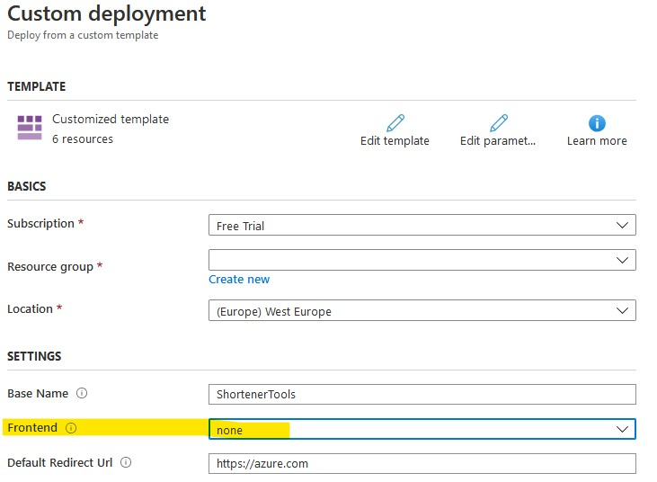
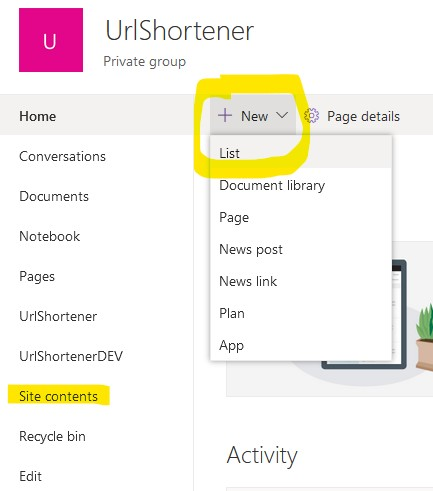
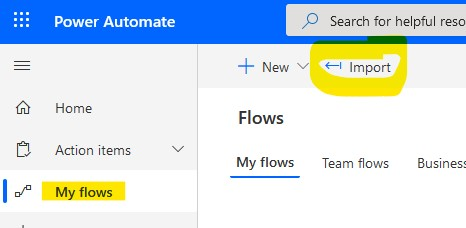
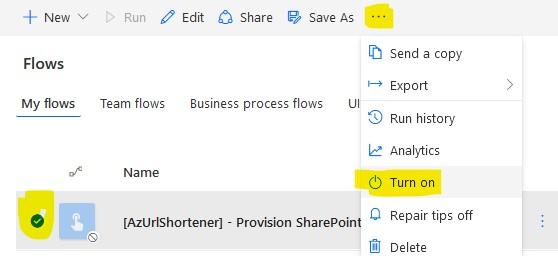
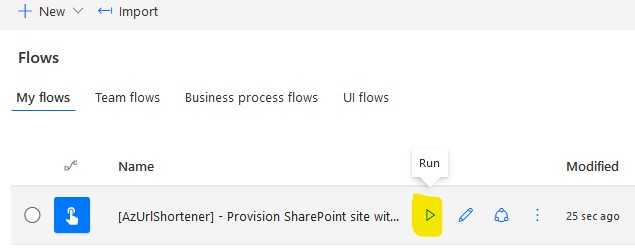
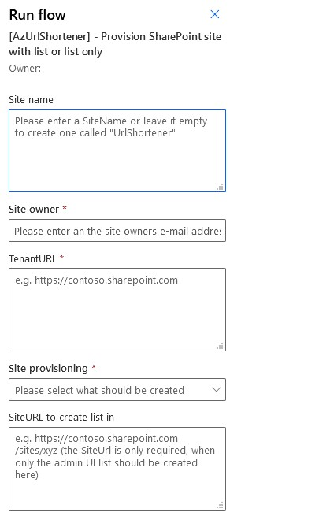
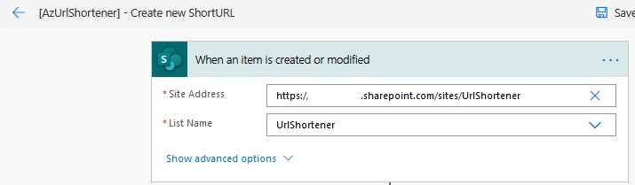
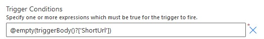
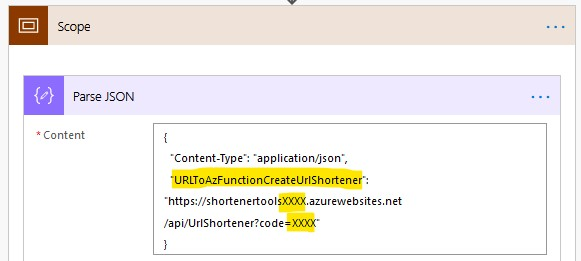
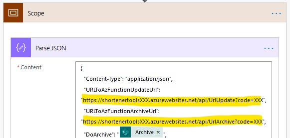

# M365 SharePoint List as Admin UI
> **Note**: Some SharePoint knowledge is required! At least you should know whats a site and a list.
> The PowerAutomate Flows require a premium license (e.g. a per user license) to use the premium connectors.

## Deployment

To deploy YOUR version of **Azure Url Shortener** to Azure and make sure you deploy the Azure Url Shortener __without__ a frontend.
You just need to click on the "Deploy to Azure" button.

> **Note**: make sure you deploy the Azure Url Shortener __without__ a frontend.

---

## How to use it

### What you need on SharePoint side
First you should have some knowledge about what's a SharePoint site (SiteCollection) and a list is. You also need to have permission to create a site or at least permission to create a list in an existing site.

Required things:
- Create a SharePoint site, or use an existing one (can be done via the linked Flows here as well to make things easier)
- Create a UrlShortener list (can be done via the provided Flow)
    - add columns to list
- Flows to call Azure Functions

Goto https://office.com, login with your M365 account and open a SharePoint site you have permission to create a list or open directly the URL to an existing SharePoint site (e.g. https://yourtenant.sharepoint.com/sites/UrlShortener)  

**Manual way - create list manually**  
On a modern page, create a list via **New => List**  

or go to **Site contents**: https://yourtenant.sharepoint.com/sites/UrlShortener/_layouts/15/viewlsts.aspx?view=14 and create it from there via **New => List**
Give the list a name.

Our new list is created and contains already a first "Title" column. You can create/add the following required columns (in this order, type and values):
| Column Name   | Column Type | Comments |
| ------------- | ------------- | -------------  |
| Url           | Hyperlink or Picture | set is as required   |
| Vanity        | Single line of text |   |
| ShortUrl      | Hyperlink or Picture |   |
| IsArchived    | Choice  | add choices: true, and false as default value  |
| Archive       | Choice  | add choice YES as only value, define no default value, set the "Display choices using" to Radio Buttons (=> This is a "help" column to trigger the flow to delete/archive the ShortUrl) |

**Automated way - via Flow (recommended way)**  
You can import a flow, which creates a site (SharePoint SiteCollection) and the list with the required columns automatically for you.

Goto: https://flow.microsoft.com  
Then import the Flow: [Download and import Flow](deployment/AzUrlShortener-ProvisionSharePointsitewithlistorlistonly_20200726183707.zip)

Select the new imported Flow, enable (Turn on) and then run it:  
 
 

During the first run you need to create a new connection to SharePoint.

The values to create a new Site and/or should be more or less self explaining. Normal case is to create a new Site, so we have a few mandatory fields which need to be filled-out even if you only want to create a list.  

| | |   
| ------------- | ------------- |
| Site name: | You can define a name for the new site (if no name is provided a site with the name "UrlShortener" will be created) |  
| Site owner: | add yourself as owner (independent if you create a site or not, if no site is added this value won't be used) |  
| Tenant URL: | https://xxx.sharepoint.com (provide your tenant URL, this URL is used when a new site is created) |  
| Site provisioning: | select here if you want to create a site with the list or the list only |
| Site URL to create list in: | in case you only want to create the list add here the URL to the already existing site. Add it in the form https://xxx.sharepoint.com/sites/NameOfYourExistingSite |

 

**Flow - Create new ShortURL**  
Yupee - you provisioned a site and a list called UrlShortener.
So you now need to import the Flows which connect to this list. After that whenever a new item is created or modified the Flow runs and creates, updates or archives a ShortUrl.

Import now the Flow as you did it before to create a new ShortUrl:  
Import the Flow: [Download and import CreateNewShortURL Flow](deployment/AzUrlShortener-CreatenewShortURL_20200726193851.zip)  
During the import you need to create a new connection to SharePoint with a useraccount who has permission to the UrlShortener site.
When the Flow is imported, open it for editing and update the Site Address so it's linked to your tenant and UrlShortener site and list.

> REMARK: the "When an item is created or modified" has a value set in the settings for Trigger Conditions: `@empty(triggerBody()?['ShortUrl'])`  
The Flow only gets triggered, when the column value of the column "ShortUrl" is empty (for new or modified item action). Just in case the UrlShortener list has been created manually and a different column name has been chosen, adapt the trigger conditions or the Flow will never run.

Next, still editing the Flow open the Scope and Parse JSON action. Here the URL to the Azure Function to create a Url needs to be added. Define the full URL, including the code here.

Save the Flow (check if you need to activate it) and now you can already test it by adding a new item to the SharePoint list. The Flow should be triggered and the list will be updated with the new created ShortURL.

**Flow - Update or Archive ShortURL**  
Import the Flow as you did it before:
Import the Flow: [Download and import UpdateOrArchiveShortURL Flow](deployment/AzUrlShortener-UpdateorArchiveShortURLValues_20200726200049.zip)

When the Flow is imported, open it for editing and update the Site Address so it's linked to your tenant and UrlShortener site.

> REMARK: the "When an item is created or modified" has a value set in the settings for Trigger Conditions: `@or(not(empty(triggerBody()?['ShortUrl'])), not(empty(triggerBody()?['Archive'])))`  
The Flow only gets triggered, when the column value of the column "ShortUrl" is NOT empty or the value to "Archive" a URL is NOT empty. This is a little bit of a hack but works.

Also here, open the Scope and Parse JSON action and add the URLs to both Azure Functions (Update and Archive). Define the full URL, including the code.

Save the flow and ensure it's activated and everything is done.

---

## What's next? What's planned?
- [ ] Use Logic Apps instead of PowerAutomate Flow
- [ ] Secure Azure Function URLs via and read them from Key Vault
- [ ] \(Optional) Replace Azure Functions with Logic Apps
- [ ] Further ideas?

---

## Question, problem?

If you have question or encounter any problem using this admin Frontend with AzShortenerUrl please feel free to ask help in the [issues section](https://github.com/FBoucher/AzUrlShortener/issues).

[adminBlazorWebsite_Url_list]: medias/adminBlazorWebsite_Url_list.png
[adminBlazorWebsite_Add_Url]: medias/adminBlazorWebsite_Add_Url.png
[portalConfig]: medias/portalConfig.png
