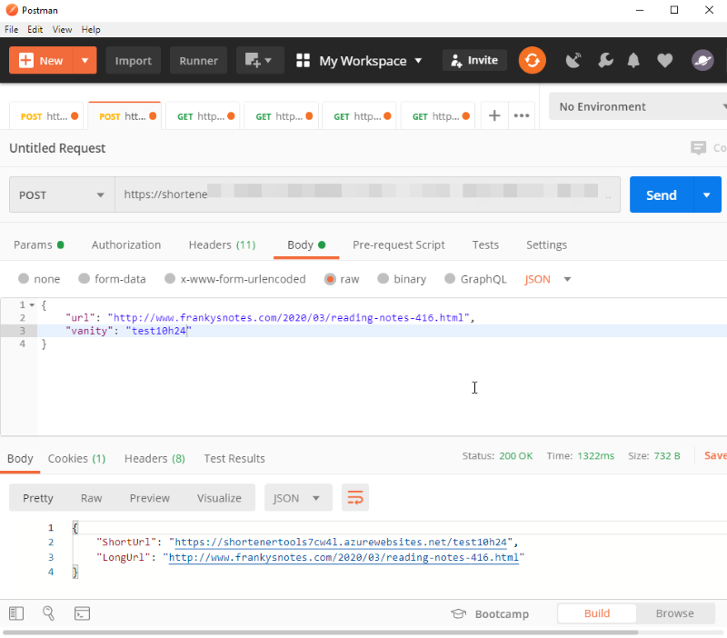
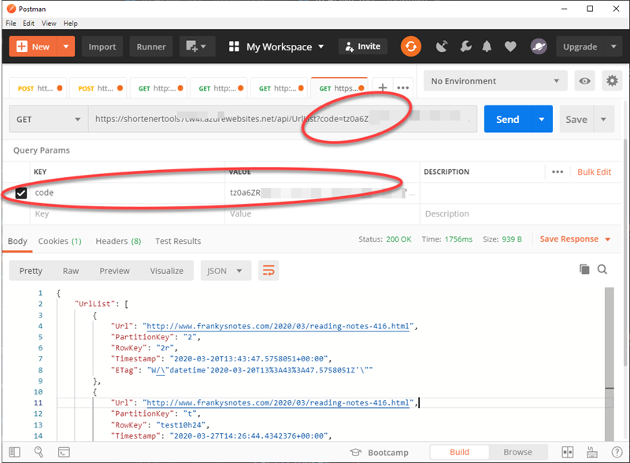

# Postman

## Deployment

Postman is a API testing tool, so there is no deployment. To get it go to [Postman website](https://www.postman.com/).

## How to use it

With Postman, you will need to create a request for each functions. Here some requirements:

- Set the request to POST.
- Add a header: Content-Type = application/json
- Use the URL **WITH** the security `Code` if the function as one. ([Read here](https://github.com/FBoucher/AzUrlShortener/blob/main/post-deployment-configuration.md#how-to-get-the-azure-function-urls) to learn how to get the URLs )

### 1- Create a short Url

In Postman, use the URL from the **UrlShortener** Azure Function.  In the body of the request, add a JSON document containing two properties. 

See the examples bellow to create short generic URL. 

```json
{
    "url": "http://www.frankysnotes.com/2020/03/reading-notes-416.html",
    "vanity": ""
}
```

If you prefer you can pass a `vanity` to have control on the end part of the Url. In this sample the vanity is `rn-416`.


```json
{
    "url": "http://www.frankysnotes.com/2020/03/reading-notes-416.html",
    "vanity": "rn-416"
}
```

To execute the call click the *Send button*. The response will be:

```json
{
    "ShortUrl": "http://localhost:7071/2r",
    "LongUrl": "http://www.frankysnotes.com/2020/03/reading-notes-416.html"
}
```




### 2- List all Urls

In Postman, use the URL from the **UrlList** Azure Function. Set the request to GET. No body content is required for this request. However, make sure the url contains the security token `code`.

    https://shortenertools.azurewebsites.net/api/UrlList?code=JVzE6CvlEHxDHbq.....


To execute the call click the *Send button*. The response will be a json document with an array:


```json
{
    "UrlList": [
        {
            "Url": "http://www.frankysnotes.com/2020/03/reading-notes-416.html",
            "PartitionKey": "2",
            "RowKey": "2r",
            "Timestamp": "2020-03-20T13:43:47.5758051+00:00",
            "ETag": "W/\"datetime'2020-03-20T13%3A43%3A47.5758051Z'\""
        },
        {
            "Url": "http://www.frankysnotes.com/2020/03/reading-notes-416.html",
            "PartitionKey": "t",
            "RowKey": "test10h24",
            "Timestamp": "2020-03-27T14:26:44.4342376+00:00",
            "ETag": "W/\"datetime'2020-03-27T14%3A26%3A44.4342376Z'\""
        },
        {
            "Url": "https://www.frankysnotes.com/2020/03/reading-notes-416.html",
            "PartitionKey": "z",
            "RowKey": "z10test",
            "Timestamp": "2020-03-20T15:27:08.8691188+00:00",
            "ETag": "W/\"datetime'2020-03-20T15%3A27%3A08.8691188Z'\""
        }
    ]
}
```




## Question, problem?

If you have question or encounter any problem using this admin interface with AzShortenerUrl please feel free to ask help in the [issues section](https://github.com/FBoucher/AzUrlShortener/issues).
